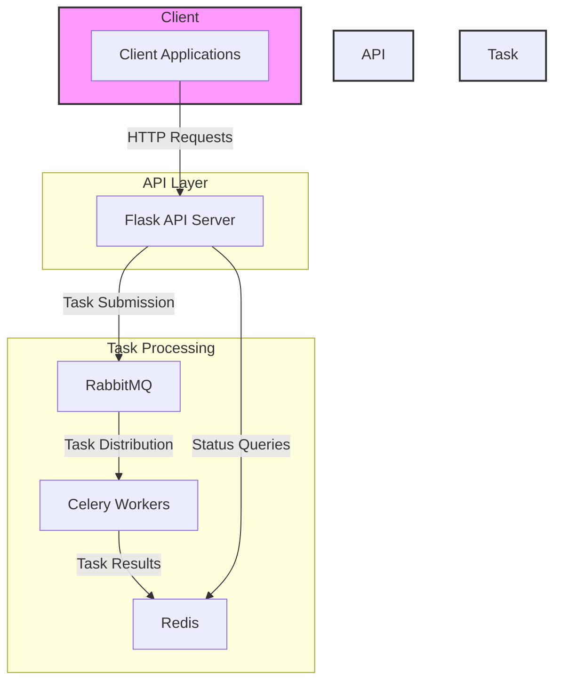
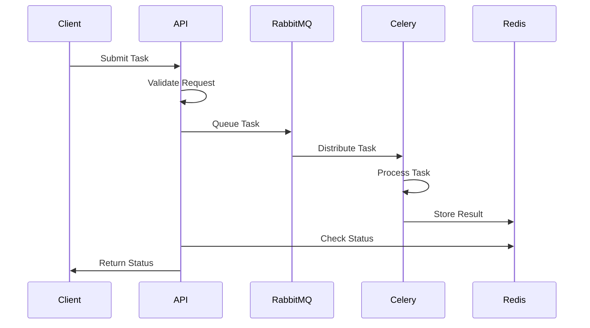
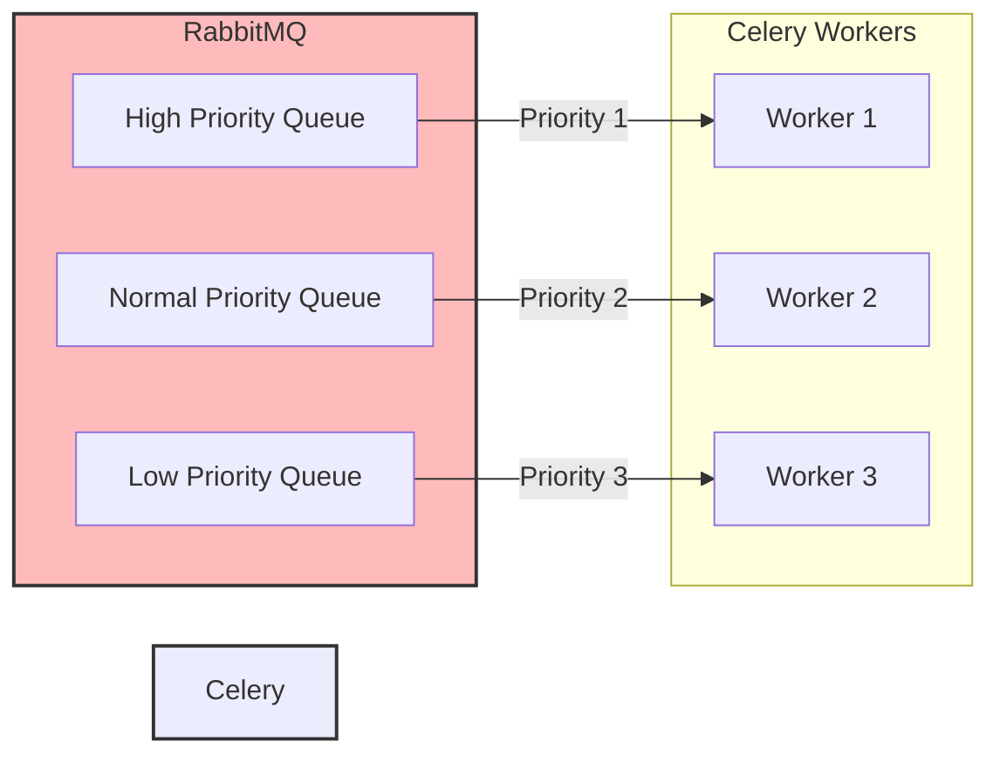
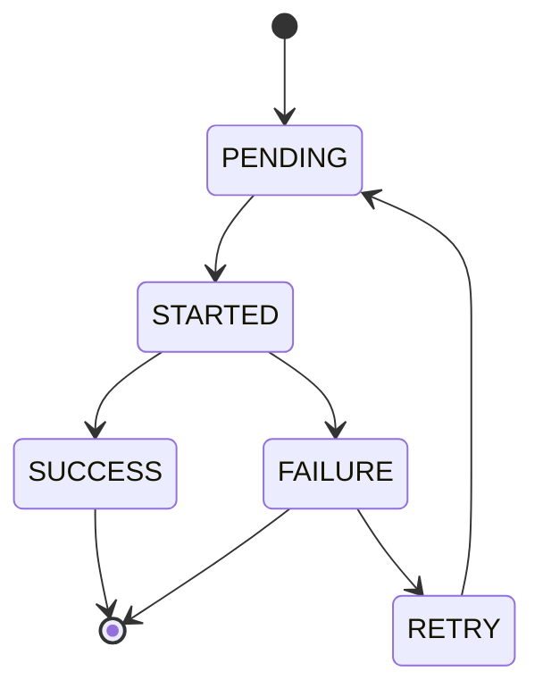
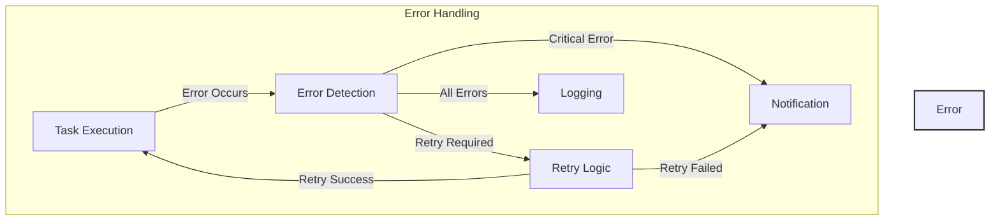
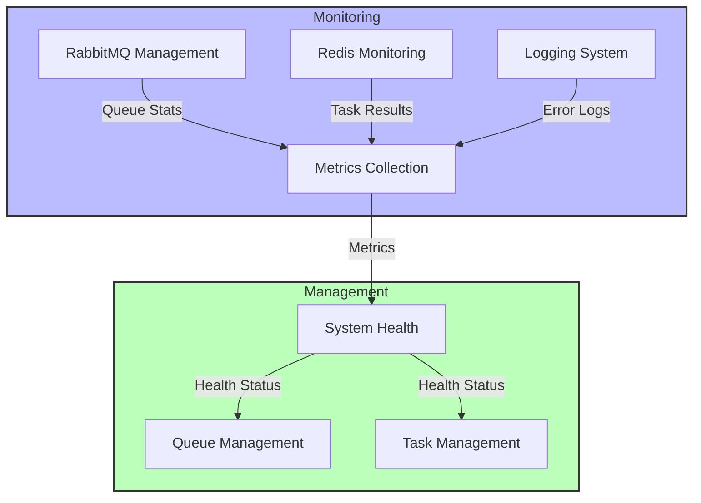
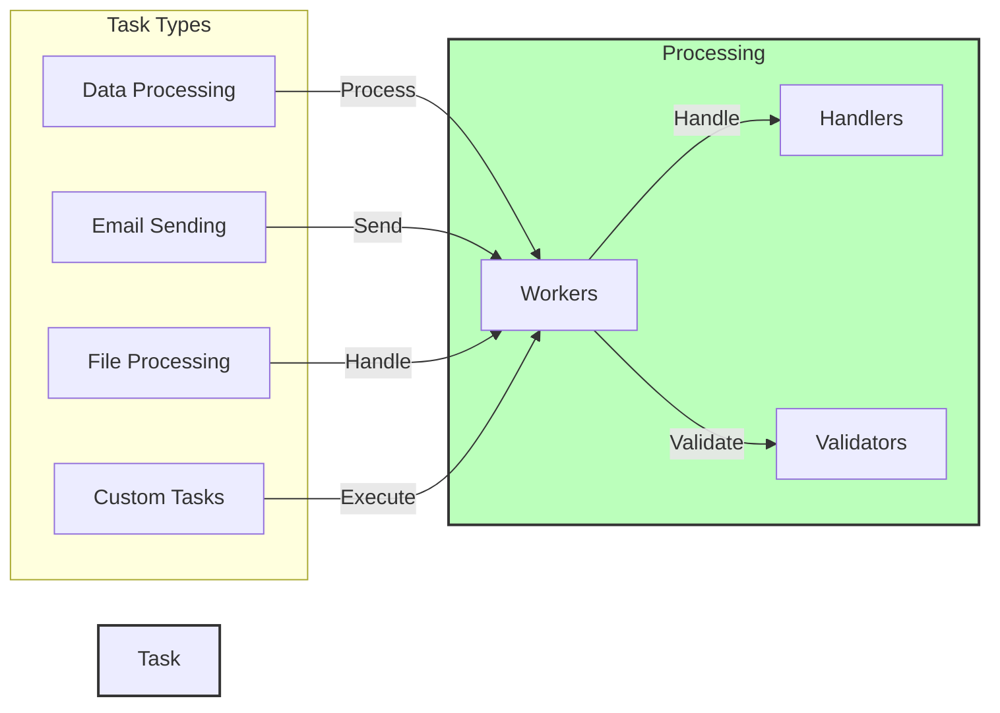

# Task Processing System Architecture Diagrams

## 1. High-Level System Architecture

**Explanation:**
- The system is divided into three main components: Client, API Layer, and Task Processing
- Client applications interact with the system through HTTP requests to the Flask API
- The API layer handles task submission and status queries
- Task processing is handled by Celery workers, with RabbitMQ for message queuing and Redis for result storage

## 2. Task Submission Flow

**Explanation:**
1. Client submits a task to the API
2. API validates the request and parameters
3. Task is queued in RabbitMQ with appropriate priority
4. Celery worker picks up the task
5. Task is processed by the worker
6. Results are stored in Redis
7. API can check task status from Redis
8. Status is returned to the client

## 3. Priority Queue Management

**Explanation:**
- Tasks are routed to different queues based on priority
- High priority tasks are processed first
- Multiple workers can handle different priority levels
- Queue management ensures fair processing of tasks

## 4. Task State Management

**Explanation:**
1. Tasks start in PENDING state
2. When picked up by a worker, state changes to STARTED
3. Tasks can either complete successfully (SUCCESS) or fail (FAILURE)
4. Failed tasks can be retried, returning to PENDING state
5. Tasks end in either SUCCESS or FAILURE state

## 5. Error Handling Flow

**Explanation:**
1. Task execution is monitored for errors
2. Errors are detected and categorized
3. Retry logic is applied for recoverable errors
4. Notifications are sent for critical errors
5. All errors are logged for monitoring
6. Successful retries return to task execution

## 6. Monitoring and Management

**Explanation:**
1. System monitoring collects data from multiple sources
2. RabbitMQ provides queue statistics
3. Redis stores task results and states
4. Logging system tracks errors and events
5. Metrics are collected for system health
6. Management interfaces allow control of queues and tasks
7. System health monitoring ensures reliable operation

## 7. Task Type Processing

**Explanation:**
1. System supports multiple task types
2. Each task type has specific processing requirements
3. Workers handle different task types
4. Validators ensure task parameters are correct
5. Handlers process specific task types
6. Custom tasks can be added to the system

These diagrams provide a comprehensive view of the task processing system's architecture and workflows. Each diagram focuses on a specific aspect of the system, making it easier to understand the different components and their interactions. 