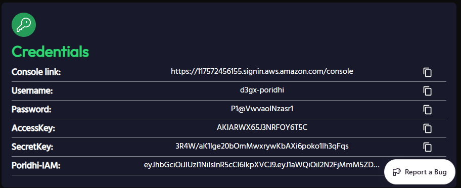

# Chapter 2: Deploying and Testing the Task Queue System on AWS EC2

This guide provides step-by-step instructions to deploy the Task Queue System (a Celery-based application with Flask, RabbitMQ, Redis, and Flower) on a signle AWS EC2 instance and test its functionality. The deployment uses Docker and Docker Compose for containerization.

## Table of Contents

- [Prerequisites](#prerequisites)
- [Launching an EC2 Instance](#launching-an-ec2-instance)
- [Installing Docker and Docker Compose](#installing-docker-and-docker-compose)
- [Transferring Project Files](#transferring-project-files)
- [Configuring the Environment](#configuring-the-environment)
- [Initializing RabbitMQ Queues](#initializing-rabbitmq-queues)
- [Starting the Application](#starting-the-application)
- [Testing the Deployment](#testing-the-deployment)
- [***Troubleshooting***](#troubleshooting)
- [Production Considerations](#production-considerations)
- [License](#license)

---

## 🎯 Project Overview

This project is divided into various chapters, each demonstrating different implementation approaches and deployment strategies:

- **Chapter 1**: Local machine and Poridhi lab implementation ([Read more](README.md))
- **Chapter 2**: AWS deployment steps ([Read more](DOC/Lab-02/aws-deployment.md))
- **Chapter 3**: Multi-EC2 instance deployment using Pulumi ([Read more](DOC\Lab-03\pulumi.md))

## Prerequisites

* An AWS account with access to the EC2 service.
* A key pair (e.g., `key-pair.pem`) for SSH access, downloaded to your local machine (e.g., `E:\key-pair.pem` on Windows).
* Basic knowledge of AWS, SSH, and Docker.

---

## Step-by-Step Deployment


### 1. Setting Up AWS Resources

####Creating a VPC

First, we'll create a Virtual Private Cloud (VPC) to isolate our resources:

1. Generate the credentials from the lab.



2. Browse to AWS Console link & fillup IAM username and password.


3. Change the region to Singapore (ap-southeast-1) the top right corner. Labs are only available for this region.


4. Navigate to the VPC Dashboard


5. Click "Create VPC"


6. Enter the following details:

  - Name tag: my-vpc-01

  - IPv4 CIDR block: 10.0.0.0/16
  - IPv6 CIDR block: No IPv6 CIDR block
  - Tenancy: Default


Then, Click "Create VPC"

### Creating Subnets

Next, we'll create a public subnet within our VPC:

1.  In the VPC Dashboard, navigate to "Subnets" & Click "Create subnet" 


2.  Enter the following details:
    - VPC ID: Select your `my-vpc-01`
    - Subnet name: `my-subnet`
    - Availability Zone: Choose the first AZ in your region ex. `ap-southeast-1a`
    - IPv4 subnet CIDR block: `10.0.0.0/24`

Then, Click "Create subnet" 


3.  Goto "Action" > "Edit Subnet Setting" 


4. Enable auto assign public ipv4 address.


### Setting Up Internet Gateway

To allow internet access to our VPC:

1. Navigate to "Internet Gateways" & Click "Create internet gateway"

 

2. Enter Name tag: `my-internet-gateway` & Click "Create internet gateway"


3. Select the newly created gateway and click "Actions" > "Attach to VPC" 


4. Select your `my-vpc-01` and click "Attach internet gateway" 


### Configuring Route Tables

Configure the route table for our public subnet:

1. Navigate to "Route Tables"
2. Click "Create route table"
3. Enter the following details:

   - Name tag: `my-route-table`
   - VPC: Select your `jwt-vpc-1`

   

4. Click "Create route table"
5. Select the route table you just created. Go to the "Routes" tab and click "Edit routes" 


6. Click "Add route" and enter the following:

- Destination: `0.0.0.0/0` (all IPv4 traffic)
- Target: Select "Internet Gateway" and choose your `jwt-igw-1` 


8. Click "Save changes"
9. Go to the "Actions" tab and click "Edit subnet associations" 


10. Select your `jwt-auth-subnet` and click "Save associations"


11. Finally see the Resource map


## Launching an EC2 Instance

Now, we'll launch an EC2 instance within our VPC:

1. Navigate to the EC2 Dashboard 
2. Click "Launch instances" 
3. Name the instance : `Task-queue-system` 
4. Choose an Amazon Machine Image (AMI):

   - Select "Ubuntu Server 22.04 LTS" (or the latest available)

   

5. Choose an Instance Type:

   - Select "t2.micro" (Free tier eligible)

6. Create a new key pair or use an existing one:

   - Key pair name: `key-pair`
   - Download the key pair (you'll need it to connect). Save it locally where you're working in vscode. Don't share it publically. Add to .gitignore


7. Network settings
Create a security group to control inbound and outbound traffic:

  * Configure a security group with inbound rules:

  * SSH (port 22) from your IP or `0.0.0.0/0` (restrict in production).
  * HTTP (port 5000) for Flask.
  * AMQP (port 5672) for RabbitMQ.
  * Redis (port 6379).
  * Flower (port 5555).
  * RabbitMQ Management UI (port 15672) *(optional, remove in production)*.
6. Click "Create security group"

   
   

8. Add Storage:
   - Keep the default settings (8GB General Purpose SSD)
9. Review and click "Launch"
10. Click "Launch Instances"


### 2. Connect to the EC2 Instance

Navigate to the directory containing your key:

```bash
icacls "D:\key_pair.pem" /inheritance:r
icacls "D:\key_pair.pem" /remove "NT AUTHORITY\Authenticated Users" "BUILTIN\Users" "BUILTIN\Administrators" "NT AUTHORITY\SYSTEM"
icacls "D:\key_pair.pem" /grant:r "%username%:F"
```

> `%USERNAME%` automatically uses your current Windows username.

**Verify the Permissions:**

```bash
icacls key_pair.pem
```

**Attempt SSH Connection:**


```bash
ssh -i "key_pair.pem" ubuntu@13.229.231.177
```

Fix key permissions if prompted (see Troubleshooting).

---

### 3. Install Docker and Docker Compose

**Update the instance:**

```bash
sudo apt update && sudo apt upgrade -y
```

**Install Docker:**

```bash
sudo apt install docker.io -y
sudo systemctl start docker
sudo systemctl enable docker
sudo usermod -aG docker ubuntu
```

**Log out and back in:**

```bash
exit
ssh -i E:\key-pair.pem ubuntu@13.229.231.177
```

**Install Docker Compose:**

```bash
sudo curl -L "https://github.com/docker/compose/releases/download/v2.20.0/docker-compose-$(uname -s)-$(uname -m)" -o /usr/local/bin/docker-compose
sudo chmod +x /usr/local/bin/docker-compose
docker-compose --version
```

---

### 4. Transfer Project Files (from CMD) IF  all required in it.

From your local machine:

```bash
scp -i "D:\key_pair.pem" -r "D:\task-queue-system\Projectfiles" ubuntu@13.229.231.177:/home/ubuntu/Task_queue_system
```

**Verify Transfer:**

```bash
ssh -i "D:\key_pair.pem" ubuntu@52.77.244.13
ls -l /home/ubuntu/Task_queue_system
```

**Adjust the Directory:**

```bash
cd /home/ubuntu/Task_queue_system
mv Projectfiles/* .
rmdir Projectfiles
ls -l
```

---

### 5. Configure the Environment

**Edit the `.env` file:**

```bash
nano .env
```

Add:

```env
RABBITMQ_USER=admin
RABBITMQ_PASS=your_secure_password
```

> Replace `your_secure_password` with a strong password.

---

### 6. Initialize RabbitMQ Queues

Run the initialization script:

```bash
docker-compose -f docker-compose.yml build web
docker-compose -f docker-compose.yml run --rm web python3 init_queues.py
```

Expected output:

```
Created queue: default
Created queue: high_priority
...
Successfully initialized all queues
```

---

### 7. Start the Application

```bash
docker-compose -f docker-compose.yml up -d
docker ps
```

You should see containers for: `rabbitmq`, `redis`, `web`, `worker`, `data_worker`, `email_worker`, `file_worker`, and `flower`.

---

### 8. Reboot the Instance

```bash
sudo reboot
```

**Reconnect and restart containers:**

```bash
ssh -i E:\key-pair.pem ubuntu@13.229.231.177
cd /home/ubuntu/My_web
docker-compose -f docker-compose.aws.yml up -d
```

---

## Testing the Deployment

### 1. Verify Services

**Flask API:**

* From local machine:

```bash
curl http://localhost:5000/
```

* From EC2 instance:

```bash
curl http://13.229.231.177:5000/
```

Expected output:

```json
{"status": "ok", "message": "Task Processing System API", ...}
```

**Flower:**

* Open [http://13.229.231.177:5555/](http://13.229.231.177:5555/) in browser.

**RabbitMQ Management UI:**

* Open [http://13.229.231.177:15672/](http://13.229.231.177:15672/) (username: `admin`, password: from `.env`).

### 2. Test Task Submission

```bash
curl -X POST http://13.229.231.177:5000/api/tasks \
  -H "Content-Type: application/json" \
  -d '{"task_type": "data_processing", "priority": "high", "parameters": {"data": "test"}, "delay": 0}'
```

> Note the returned `task_id` (e.g., `{"task_id": "1234-5678", ...}`).

### 3. Check Task Status

```bash
curl http://13.229.231.177:5000/api/tasks/<task_id>
```

Expected output:

```json
{"status": "completed", "result": ...}
```

---

## Troubleshooting

**SSH Permission Denied:**
Fix key permissions:

```bash
icacls E:\key-pair.pem /inheritance:r
icacls E:\key-pair.pem /remove "NT AUTHORITY\Authenticated Users" "BUILTIN\Users" "BUILTIN\Administrators" "NT AUTHORITY\SYSTEM"
icacls E:\key-pair.pem /grant:r "DESKTOP-RN29TTL\Shaan:F"
```

**Install `python3-venv`:**

```bash
sudo apt update
sudo apt install python3.12-venv
```

**Create & Activate Virtual Environment:**

```bash
python3 -m venv venv
source venv/bin/activate
```

**Install dependencies:**

```bash
pip install requests
```

**ModuleNotFoundError:**
Avoid host installation; use Docker container method as shown.

**Container Failures:**

```bash
docker logs <container-id>
```

> While testing the web address, ensure VPN is turned **off**.

**Reconnect After Network Loss:**

```bash
ssh -i "D:\key_pair.pem" ubuntu@52.77.244.13
cd /home/ubuntu/Task_queue_system
python3 -m venv venv
source venv/bin/activate
```

**Port Issues:**
Ensure EC2 security group allows inbound access to:

* Port 5000 (Flask)
* Port 5555 (Flower)
* Port 15672 (RabbitMQ UI)
* Port 5672 (AMQP)
* Port 6379 (Redis)

---

## Production Considerations

* Restrict security group ports (e.g., 5672, 6379, 5555) to the VPC or specific IPs.
* Use EBS for persistent storage of `rabbitmq_data` and `redis_data`.
* Store credentials in AWS Secrets Manager.
* Set up CloudWatch for monitoring.
* Consider Auto Scaling or AWS ECS for scalability.

---

## License

\[Add your license here, e.g., MIT License]
