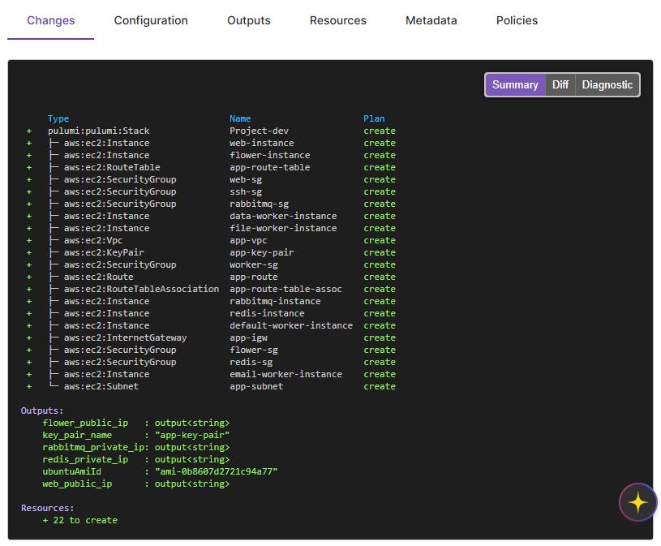
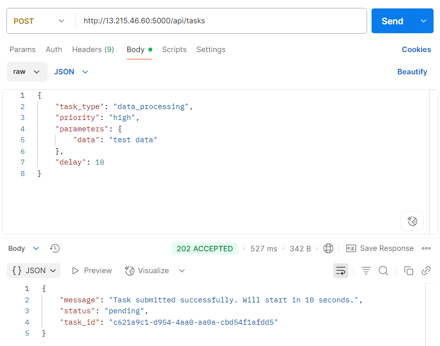
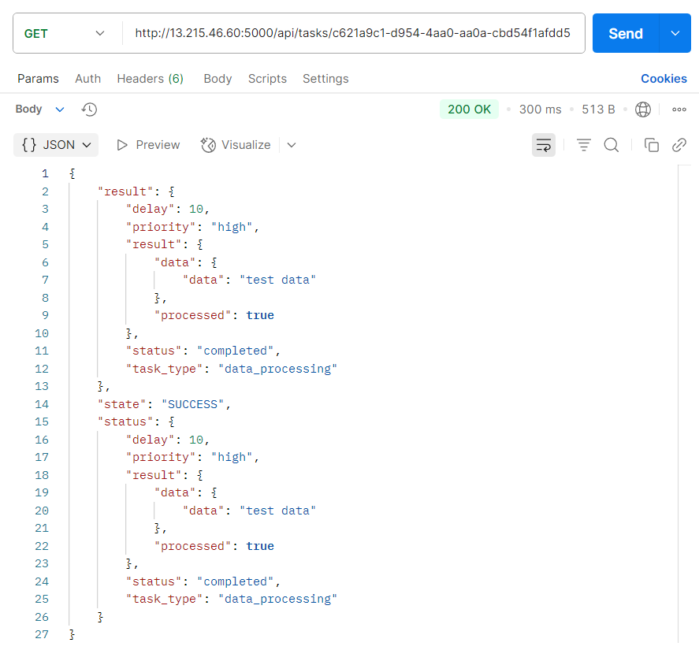

# Asynchronous Task Queue Processing System on AWS with Pulumi

 **Table of Contents**

 - [Overview](#overview)
 - [Project Layout](#project-layout)
 - [Architecture Diagram](#architecture-diagram)
 - [Prerequisites](#prerequisites)
 - [Setup Instructions](#setup-instructions)
   - [1. Configure AWS CLI](#1-configure-aws-cli)
   - [2. Set Up Project Directory and Virtual Environment](#2-set-up-project-directory-and-virtual-environment)
   - [3. Install Pulumi](#3-install-pulumi)
   - [4. Initialize a Pulumi Project](#4-initialize-a-pulumi-project)
   - [5. Configure Infrastructure](#5-configure-infrastructure)
   - [6. Set Up SSH Key Pair](#6-set-up-ssh-key-pair)
   - [7. Install Dependencies](#7-install-dependencies)
   - [8. Deploy the Pulumi Stack](#8-deploy-the-pulumi-stack)
 - [Updating Infrastructure](#updating-infrastructure)
 - [Destroying Infrastructure](#destroying-infrastructure)
 - [Best Practices](#best-practices)
 - [Troubleshooting](#troubleshooting)
 - [Resources](#resources)
 - [License](#license)

## Overview

This project guides you through setting up an asynchronous task queue processing system on AWS using Pulumi for infrastructure automation. The system is secure, containerized with Docker, and deployed on AWS EC2 instances within a custom VPC. This `README.md` provides step-by-step instructions to configure, deploy, manage, and troubleshoot the infrastructure.

## 🎯 Project Overview

This project is divided into various chapters, each demonstrating different implementation approaches and deployment strategies:

- **Chapter 1**: Local machine and Poridhi lab implementation ([Read more](README.md))
- **Chapter 2**: AWS deployment steps ([Read more](DOC/Lab-02/aws-deployment.md))
- **Chapter 3**: Multi-EC2 instance deployment using Pulumi ([Read more](DOC\Lab-03\pulumi.md))

## Project Layout

```bash
asynchronous_task_queue_aws_deployment_in_multi_instances/
├── images/
│   ├── architecture.png
│   └── project-structure.png
├── pulumi/
│   ├── __main__.py
│   └── requirements.txt
├── README.md
└── other files...
```

## Architecture Diagram


## Prerequisites

Before starting, ensure you have the following:
- **AWS Account**: With credentials (Access Key ID and Secret Access Key) from the AWS Management Console.
- **Pulumi Account**: Sign up at [Pulumi](https://app.pulumi.com) to obtain an access token.
- **Python 3.8+**: Installed on your system.
- **AWS CLI**: Installed ([AWS CLI Installation Guide](https://docs.aws.amazon.com/cli/latest/userguide/install-cliv2.html)).
- **SSH Key Pair**: For EC2 instance access.
- **Docker**: Installed for containerized services.
- **Git**: For version control (recommended).


## Setup Instructions

### 1. Configure AWS CLI

Configure the AWS CLI with your credentials:

```bash
aws configure
```

To see your current AWS CLI configuration, use the following command in your terminal or PowerShell:
```bash
aws configure list
```

- **Prompts**:
    - **AWS Access Key ID**: Obtain from the AWS Lab description page.
    - **AWS Secret Access Key**: Obtain from the AWS Lab description page.
    - **Default region name**: Set to `ap-southeast-1`.
    - **Default output format**: Choose `json` (or your preferred format).

### 2. Set Up Project Directory and Virtual Environment

Create a dedicated directory for your Pulumi project and set up a Python virtual environment:

```bash
mkdir pulumi
cd pulumi
sudo apt update # On Linux
sudo apt install python3.8-venv -y # On Linux
# python3 -m venv venv # 
# source venv/bin/activate  # On Windows: venv\Scripts\activate
```

### 3. Install Pulumi

Install Pulumi using a package manager or manually:

- **On Windows (using Chocolatey)**:
    ```powershell
    choco install pulumi -y
    ```

- **On Linux/MacOS**:
    Follow the [Pulumi Installation Guide](https://www.pulumi.com/docs/get-started/install/).

Verify installation:
```bash
pulumi version
```

### 4. Initialize a Pulumi Project

Log in to Pulumi using your access token from [Pulumi Tokens](https://app.pulumi.com/account/tokens):

```bash
pulumi login
```

Initialize a new Pulumi project:

```bash
pulumi new aws-python
```

- **Prompts**:
    - Accept default options for most prompts.
    - Set the AWS region to `ap-southeast-1`.

### 5. Configure Infrastructure

Replace the contents of `__main__.py` in the `pulumi` directory with the following code to provision a VPC, subnet, security groups, and EC2 instances:


If you see any error while importing pulumi_aws, install the required Python packages:

```bash
pip install pulumi-aws
```

This will install the Pulumi AWS provider package and its dependencies, which is required for the infrastructure code to work.


```python
import pulumi
import pulumi_aws as aws

# Create a VPC
vpc = aws.ec2.Vpc("app-vpc",
    cidr_block="10.0.0.0/16",
    enable_dns_hostnames=True,
    enable_dns_support=True,
    tags={
        "Name": "my-vpc"
    }
)

# Create an Internet Gateway
igw = aws.ec2.InternetGateway("app-igw",
    vpc_id=vpc.id,
    tags={
        "Name": "my-internet-gateway"
    }
)

# Create a public subnet
subnet = aws.ec2.Subnet("app-subnet",
    vpc_id=vpc.id,
    cidr_block="10.0.1.0/24",
    availability_zone="ap-southeast-1a",
    map_public_ip_on_launch=True,
    tags={
        "Name": "my-public-subnet"
    }
)

# Create a Route Table
route_table = aws.ec2.RouteTable("app-route-table",
    vpc_id=vpc.id,
    tags={
        "Name": "my-route-table"
    }
)


# Create a route to the Internet Gateway
route = aws.ec2.Route("app-route",
    route_table_id=route_table.id,
    destination_cidr_block="0.0.0.0/0",
    gateway_id=igw.id,
)

# Associate the Route Table with the subnet
route_table_association = aws.ec2.RouteTableAssociation("app-route-table-assoc",
    subnet_id=subnet.id,
    route_table_id=route_table.id
)

ssh_sg = aws.ec2.SecurityGroup("ssh-sg",
    vpc_id=vpc.id,
    description="Allow SSH access",
    ingress=[
        aws.ec2.SecurityGroupIngressArgs(
            protocol="tcp",
            from_port=22,
            to_port=22,
            cidr_blocks=["0.0.0.0/0"]  # Restrict to your IP in production
        )
    ],
    egress=[
        aws.ec2.SecurityGroupEgressArgs(
            protocol="-1",
            from_port=0,
            to_port=0,
            cidr_blocks=["0.0.0.0/0"]
        )
    ]
)
rabbitmq_sg = aws.ec2.SecurityGroup("rabbitmq-sg",
    vpc_id=vpc.id,
    description="Allow RabbitMQ traffic",
    ingress=[
        aws.ec2.SecurityGroupIngressArgs(
            protocol="tcp",
            from_port=5672,
            to_port=5672,
            cidr_blocks=["10.0.0.0/16"]
        ),
        aws.ec2.SecurityGroupIngressArgs(
            protocol="tcp",
            from_port=15672,
            to_port=15672,
            cidr_blocks=["10.0.0.0/16"]
        )
    ],
    egress=[
        aws.ec2.SecurityGroupEgressArgs(
            protocol="-1",
            from_port=0,
            to_port=0,
            cidr_blocks=["0.0.0.0/0"]
        )
    ]
)

redis_sg = aws.ec2.SecurityGroup("redis-sg",
    vpc_id=vpc.id,
    description="Allow Redis traffic",
    ingress=[
        aws.ec2.SecurityGroupIngressArgs(
            protocol="tcp",
            from_port=6379,
            to_port=6379,
            cidr_blocks=["10.0.0.0/16"]
        )
    ],
    egress=[
        aws.ec2.SecurityGroupEgressArgs(
            protocol="-1",
            from_port=0,
            to_port=0,
            cidr_blocks=["0.0.0.0/0"]
        )
    ]
)

web_sg = aws.ec2.SecurityGroup("web-sg",
    vpc_id=vpc.id,
    description="Allow web traffic",
    ingress=[
        aws.ec2.SecurityGroupIngressArgs(
            protocol="tcp",
            from_port=5000,
            to_port=5000,
            cidr_blocks=["0.0.0.0/0"]
        ),
        aws.ec2.SecurityGroupIngressArgs(
            protocol="tcp",
            from_port=22,
            to_port=22,
            cidr_blocks=["0.0.0.0/0"]  # Restrict to your IP in production
        )
    ],
    egress=[
        aws.ec2.SecurityGroupEgressArgs(
            protocol="-1",
            from_port=0,
            to_port=0,
            cidr_blocks=["0.0.0.0/0"]
        )
    ]
)

worker_sg = aws.ec2.SecurityGroup("worker-sg",
    vpc_id=vpc.id,
    description="Allow worker traffic",
    ingress=[
        aws.ec2.SecurityGroupIngressArgs(
            protocol="tcp",
            from_port=22,
            to_port=22,
            cidr_blocks=["0.0.0.0/0"]  # Restrict to your IP in production
        )
    ],
    egress=[
        aws.ec2.SecurityGroupEgressArgs(
            protocol="-1",
            from_port=0,
            to_port=0,
            cidr_blocks=["0.0.0.0/0"]
        )
    ]
)

flower_sg = aws.ec2.SecurityGroup("flower-sg",
    vpc_id=vpc.id,
    description="Allow Flower traffic",
    ingress=[
        aws.ec2.SecurityGroupIngressArgs(
            protocol="tcp",
            from_port=5555,
            to_port=5555,
            cidr_blocks=["0.0.0.0/0"]
        ),
        aws.ec2.SecurityGroupIngressArgs(
            protocol="tcp",
            from_port=22,
            to_port=22,
            cidr_blocks=["0.0.0.0/0"]  # Restrict to your IP in production
        )
    ],
    egress=[
        aws.ec2.SecurityGroupEgressArgs(
            protocol="-1",
            from_port=0,
            to_port=0,
            cidr_blocks=["0.0.0.0/0"]
        )
    ]
)

# Create an EC2 key pair
key_pair = aws.ec2.KeyPair("app-key-pair",
    key_name="app-key-pair",
    # public_key="ssh-rsa YOUR_PUBLIC_KEY_HERE"  # Replace with your public key
    public_key="ssh-rsa AAAAB3NzaC1yc2EAAAADAQABAAABAQCmPe6iw/kbZCbaQxaauIVEl9Vn8SWzijFREVwZx6anWBkJwhGNhRX4N7AXV35/fMdeiJmxHBr+wH6P2KJAg3NDX7a3VdDcoUPqzFKCzjAd6SvkELz+Gi6FjL+dFARhnGhoXuQD628DE+BvfD3XMV3YKJmfcWqXb5ciSDP/+rm6AL7XDT1M4ErgkQ63h2qfCizBMEsP5IwNw/ZmniE7sDXT2CG6MaW9yFenTbKC/k2xElx4WjtuVBlEHV72l+Er4sOVm5VXCQS0BUCYxu/BWHoWwmESZRtYsg7v1vLLqQrBSej1Lsmwj7aIMkQNjOHiv3BWO77+uoDwBjU7ExiZmoBn shaan@DESKTOP-RN29TTL"  # Replace with your public key
)


# Get the latest Ubuntu 22.04 LTS AMI
ubuntu_ami = aws.ec2.get_ami(
    most_recent=True,
    filters=[
        aws.ec2.GetAmiFilterArgs(
            name="name",
            values=["ubuntu/images/hvm-ssd/ubuntu-jammy-22.04-amd64-server-*"]
        ),
        aws.ec2.GetAmiFilterArgs(
            name="virtualization-type",
            values=["hvm"]
        )
    ],
    owners=["099720109477"]  # Canonical's AWS account ID
)

# User data script for Ubuntu
user_data = """#!/bin/bash
apt-get update -y
apt-get install -y docker.io git
systemctl start docker
systemctl enable docker
usermod -aG docker ubuntu
curl -L "https://github.com/docker/compose/releases/download/v2.20.0/docker-compose-$(uname -s)-$(uname -m)" -o /usr/local/bin/docker-compose
chmod +x /usr/local/bin/docker-compose

# Clone the repository
git clone https://github.com/poridhioss/asynchronous_task_processing_system_using_Flask_Celery_RabbitMQ.git
cd asynchronous_task_processing_system_using_Flask_Celery_RabbitMQ

# Create .env file with the correct IPs
cat > .env << EOL
RABBITMQ_HOST=${rabbitmq_private_ip}
REDIS_HOST=${redis_private_ip}
FLASK_APP=app.py
FLASK_ENV=development
RABBITMQ_USER=guest
RABBITMQ_PASS=guest
EOL

# Start the containers
docker-compose up -d

# Wait for services to be ready
sleep 30

# Check container status
docker ps
"""


# Create EC2 instances
rabbitmq_instance = aws.ec2.Instance("rabbitmq-instance",
    instance_type="t2.micro",
    ami=ubuntu_ami.id,
    subnet_id=subnet.id,
    vpc_security_group_ids=[rabbitmq_sg.id],
    key_name=key_pair.key_name,
    user_data=user_data,
    associate_public_ip_address=True,
    tags={"Name": "rabbitmq-instance"}
)

redis_instance = aws.ec2.Instance("redis-instance",
    instance_type="t2.micro",
    ami=ubuntu_ami.id,
    subnet_id=subnet.id,
    vpc_security_group_ids=[redis_sg.id],
    key_name=key_pair.key_name,
    user_data=user_data,
    associate_public_ip_address=True,
    tags={"Name": "redis-instance"}
)

web_instance = aws.ec2.Instance("web-instance",
    instance_type="t2.micro",
    ami=ubuntu_ami.id,
    subnet_id=subnet.id,
    vpc_security_group_ids=[web_sg.id],
    key_name=key_pair.key_name,
    user_data=user_data,
    associate_public_ip_address=True,
    tags={"Name": "web-instance"}
)

default_worker_instance = aws.ec2.Instance("default-worker-instance",
    instance_type="t2.micro",
    ami=ubuntu_ami.id,
    subnet_id=subnet.id,
    vpc_security_group_ids=[worker_sg.id],
    key_name=key_pair.key_name,
    user_data=user_data,
    associate_public_ip_address=True,
    tags={"Name": "default-worker-instance"}
)

data_worker_instance = aws.ec2.Instance("data-worker-instance",
    instance_type="t2.micro",
    ami=ubuntu_ami.id,
    subnet_id=subnet.id,
    vpc_security_group_ids=[worker_sg.id],
    key_name=key_pair.key_name,
    user_data=user_data,
    associate_public_ip_address=True,
    tags={"Name": "data-worker-instance"}
)

email_worker_instance = aws.ec2.Instance("email-worker-instance",
    instance_type="t2.micro",
    ami=ubuntu_ami.id,
    subnet_id=subnet.id,
    vpc_security_group_ids=[worker_sg.id],
    key_name=key_pair.key_name,
    user_data=user_data,
    associate_public_ip_address=True,
    tags={"Name": "email-worker-instance"}
)

file_worker_instance = aws.ec2.Instance("file-worker-instance",
    instance_type="t2.micro",
    ami=ubuntu_ami.id,
    subnet_id=subnet.id,
    vpc_security_group_ids=[worker_sg.id],
    key_name=key_pair.key_name,
    user_data=user_data,
    associate_public_ip_address=True,
    tags={"Name": "file-worker-instance"}
)

flower_instance = aws.ec2.Instance("flower-instance",
    instance_type="t2.micro",
    ami=ubuntu_ami.id,
    subnet_id=subnet.id,
    vpc_security_group_ids=[flower_sg.id],
    key_name=key_pair.key_name,
    user_data=user_data,
    associate_public_ip_address=True,
    tags={"Name": "flower-instance"}
)

# Export instance IPs and key pair name
pulumi.export("key_pair_name", key_pair.key_name)
pulumi.export("rabbitmq_private_ip", rabbitmq_instance.private_ip)
pulumi.export("redis_private_ip", redis_instance.private_ip)
pulumi.export("web_public_ip", web_instance.public_ip)
pulumi.export("flower_public_ip", flower_instance.public_ip)
pulumi.export("ubuntuAmiId", ubuntu_ami.id)

```

### 6. Set Up SSH Key Pair

Open new terminal and Generate an SSH key pair for EC2 instances:

```bash
ssh-keygen -t rsa -b 2048 -f app-key-pair
```

- Press `Enter` twice when prompted for a passphrase.
- Copy the public key:

```bash
cat app-key-pair.pub
```

- Update the `public_key` field in the `aws.ec2.KeyPair` resource in `__main__.py` with the copied value.

### 7. Install Dependencies

Create a `requirements.txt` file in the `pulumi` directory:

```text
pulumi==3.173.0
pulumi-aws==6.81.0
```

Install dependencies in the virtual environment:

```bash
pip install -r requirements.txt
```

### 8. Deploy the Pulumi Stack

Deploy the infrastructure:

```bash
pulumi up --yes
```

- **In pulumi accournt**



Pulumi will:
- Create a VPC, subnet, internet gateway, and route table.
- Set up security groups for RabbitMQ, Redis, web, worker, and Flower services.
- Launch EC2 instances with Docker and Docker Compose installed.
- Output public/private IPs and the key pair name.

Access the system at the `web_public_ip` and Flower dashboard at the `flower_public_ip`.

Verify Deployment Outputs:
Run the following to see the outputs:
```bash
pulumi stack output
```
Example output:
```bash
Current stack outputs (6):
    OUTPUT               VALUE
    flower_public_ip     54.179.173.96
    key_pair_name        app-key-pair
    rabbitmq_private_ip  10.0.1.128
    redis_private_ip     10.0.1.9
    ubuntuAmiId          ami-0b8607d2721c94a77
    web_public_ip        13.215.46.60
```

Open the Browser

For the web application (Flask API), open:
```bash
http://<web_public_ip>:5000
```
For the web application (Flask API), open:
```bash
http://<flower_public_ip>:5555
```
### For testing task:
Run the following command:
```bash
python test_tasks.py
```

## Updating Infrastructure

To modify infrastructure (e.g., change instance types or add resources), edit `__main__.py` and run:

```bash
pulumi up --yes
```

To synchronize Pulumi's state with AWS (if manual changes were made):

```bash
pulumi refresh
```

## API Endpoints
1. **Submit a Task**
Open Postman application. Then, follow the following commands:
```
POST http://<web-instance-public-id>:5000/api/tasks
```
You can see:


To check the task:


**Headers:**
```
Content-Type: application/json
```

**Request Body:**
```bash
{
    "task_type": "data_processing",
    "priority": "high",
    "parameters": {
        "data": "test data"
    },
    "delay": 0
}
```
**Using curl:**
```bash
curl -X POST http://localhost:5000/api/tasks \
  -H "Content-Type: application/json" \
  -d '{
    "task_type": "data_processing",
    "priority": "high",
    "parameters": {
      "data": "test data"
    },
    "delay": 0
  }'
```

## Destroying Infrastructure

To tear down all resources and avoid AWS charges:

```bash
pulumi destroy
```

Confirm when prompted.

## 

If AWS credentials are configured. Let's try to initialize the Pulumi stack first:
```bash
pulumi stack init dev
```

If the stack already exists. Let's try to select it and then update:
```bash
pulumi stack select dev
```

## Best Practices

1. **Version Control**: Store Pulumi code in a Git repository.
2. **Environment Separation**: Use separate stacks for development, staging, and production.
3. **Secret Management**: Use Pulumi's secret management for sensitive data (e.g., SSH keys).
4. **Modularization**: Organize complex infrastructure into reusable Pulumi modules.
5. **Tagging**: Tag all resources for cost tracking and organization.
6. **Documentation**: Maintain updated documentation for your infrastructure code.
7. **Testing**: Test changes in a non-production environment before deploying.

## Troubleshooting

Check here. ([Read more](DOC\Lab-03\troubleshooting.md))

## Resources

- [Pulumi Documentation](https://www.pulumi.com/docs/)
- [AWS CLI Documentation](https://docs.aws.amazon.com/cli/)
- [Docker Documentation](https://docs.docker.com/)
- [Chocolatey Documentation](https://docs.chocolatey.org/)

## License

This project is licensed under the MIT License.
```
