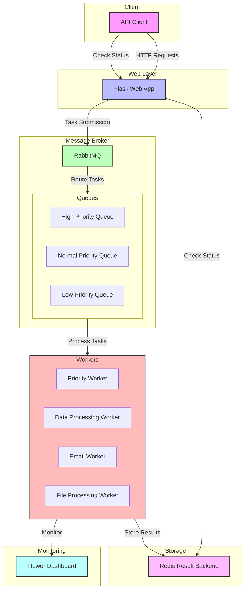

```mermaid
graph TB
    subgraph Client
        API[API Client]
    end

    subgraph Web Layer
        Flask[Flask Web App]
    end

    subgraph Message Broker
        RabbitMQ[RabbitMQ]
        subgraph Queues
            HighQ[High Priority Queue]
            NormalQ[Normal Priority Queue]
            LowQ[Low Priority Queue]
        end
    end

    subgraph Workers
        PriorityW[Priority Worker]
        DataW[Data Processing Worker]
        EmailW[Email Worker]
        FileW[File Processing Worker]
    end

    subgraph Storage
        Redis[Redis Result Backend]
    end

    subgraph Monitoring
        Flower[Flower Dashboard]
    end

    API -->|HTTP Requests| Flask
    Flask -->|Task Submission| RabbitMQ
    RabbitMQ -->|Route Tasks| Queues
    Queues -->|Process Tasks| Workers
    Workers -->|Store Results| Redis
    Workers -->|Monitor| Flower
    Flask -->|Check Status| Redis
    API -->|Check Status| Flask

    style API fill:#f9f,stroke:#333,stroke-width:2px
    style Flask fill:#bbf,stroke:#333,stroke-width:2px
    style RabbitMQ fill:#bfb,stroke:#333,stroke-width:2px
    style Workers fill:#fbb,stroke:#333,stroke-width:2px
    style Redis fill:#fbf,stroke:#333,stroke-width:2px
    style Flower fill:#bff,stroke:#333,stroke-width:2px
``` 