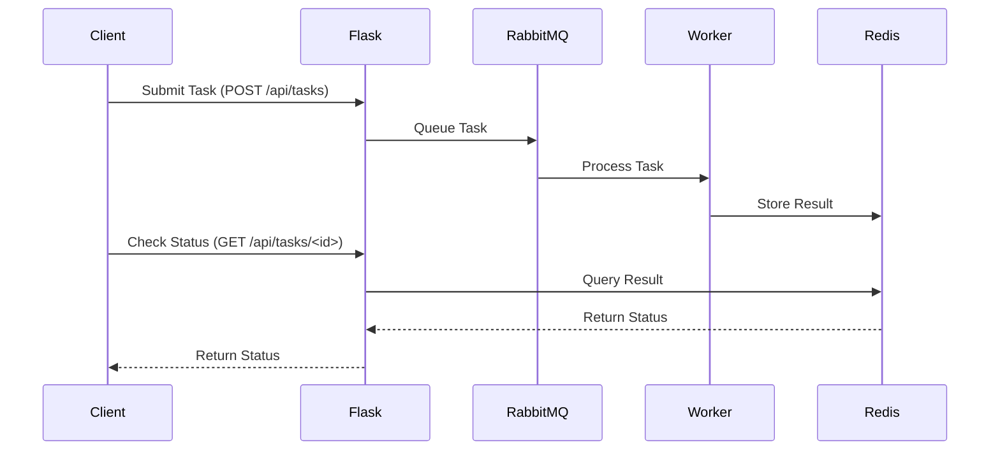
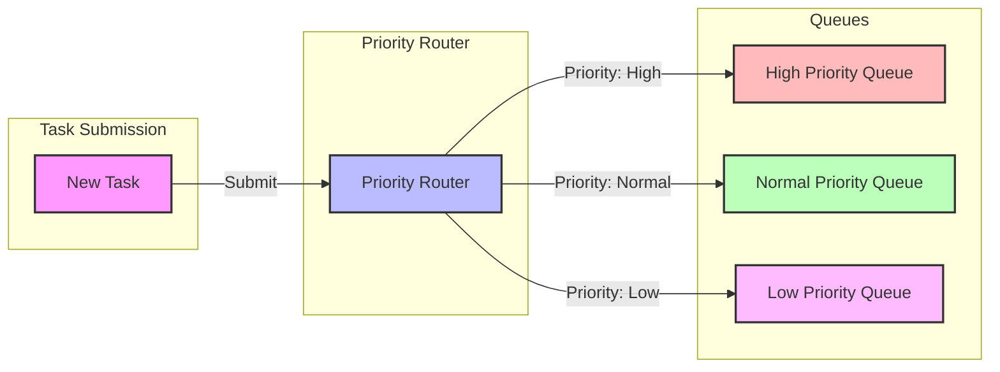
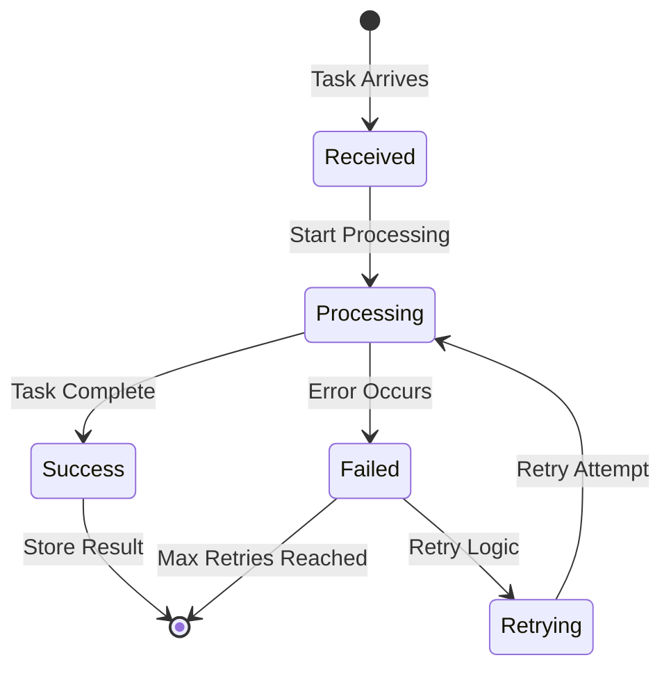
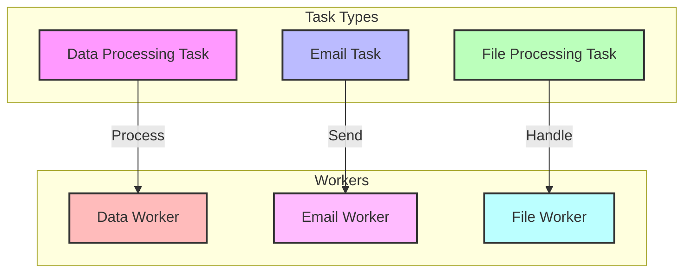
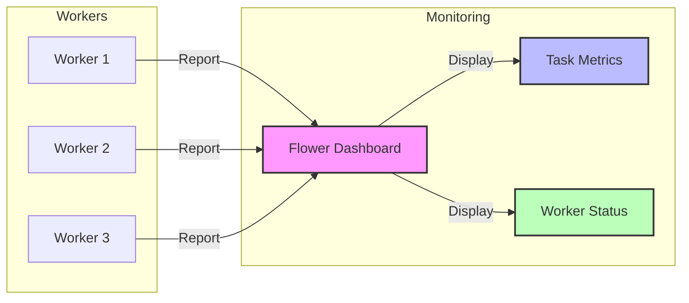
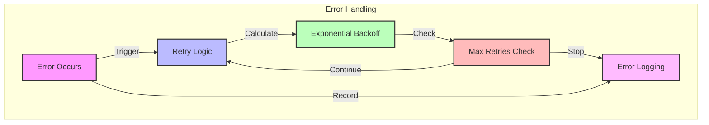

# Task Processing System Component Diagrams

## 1. Client Interaction Flow

## 2. Priority Queue System

## 3. Worker Processing Flow

## 4. Task Types and Workers

## 5. Monitoring System

## 6. Error Handling Flow
